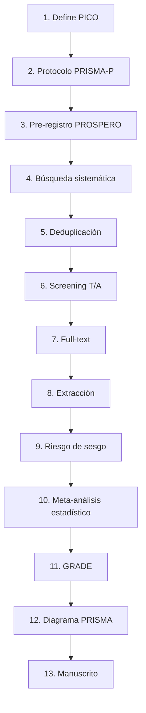

# Meta-analysis Optimization

> Monorepo para conducir meta-análisis médicos siguiendo PRISMA 2020 con workflow optimizado, skills automatizados de Claude Code, y mejora continua de la metodología.

## ⚡ TL;DR

Este repo contiene:
- **`_template/`** — los archivos plantilla (STATUS.md, protocolo.md, CSVs, etc.) que se copian al iniciar un meta-análisis nuevo
- **`projects/`** — donde viven tus meta-análisis reales (uno por carpeta)
- **`.claude/skills/`** — 9 skills automatizados que Claude Code usa para guiarte por PRISMA paso a paso
- **`docs/`** — lecciones aprendidas + changelog del workflow

## 🚀 Iniciar un meta-análisis nuevo

```bash
cd ~/projects/metanalysis-optimization
./scripts/new-project.sh meta-<tema>-<intervencion>
# ej: ./scripts/new-project.sh meta-diabetes-metformina
```

Esto crea `projects/meta-<tema>-<intervencion>/` con todos los archivos plantilla. Luego edita el STATUS.md con tu PICO y abre Claude Code:

> "trabajemos en projects/meta-diabetes-metformina, empecemos el protocolo"

## 📐 Estructura

```
metanalysis-optimization/
├── README.md                              # este archivo
├── CLAUDE.md                              # reglas globales del workflow para Claude
├── .claude/skills/                        # 9 skills compartidos por todos los proyectos
│   ├── prisma-search.md
│   ├── screen-paper.md
│   ├── extract-data.md
│   ├── assess-rob.md
│   ├── run-metaanalysis.md
│   ├── prisma-flow.md
│   ├── prospero-register.md
│   ├── grade-evidence.md
│   └── manuscript-prisma.md
├── _template/                             # archivos que se copian al iniciar proyecto
│   ├── STATUS.md
│   ├── protocolo/protocolo.md
│   ├── busqueda/strategy.md
│   ├── extraccion/{screening,extraction,rob}.csv
│   ├── extraccion/papers/
│   └── analisis/{stats.py,prisma-flow.md}
├── projects/                              # ⭐ TUS META-ANÁLISIS REALES
│   ├── meta-diabetes-metformina/
│   ├── meta-hta-amlodipino/
│   └── ...
├── docs/
│   ├── lessons-learned.md                 # qué hemos aprendido haciendo meta-análisis
│   └── changelog.md                       # historial de cambios al workflow
├── scripts/
│   └── new-project.sh                     # inicializa un proyecto nuevo desde _template
├── requirements.txt                       # deps Python compartidas
└── .gitignore
```

## 🔄 Workflow PRISMA 2020 — 13 pasos



| Paso | Skill | Output |
|---|---|---|
| 1 | (manual) | `STATUS.md`, sección PICO |
| 2 | (manual) | `protocolo/protocolo.md` |
| 3 | `/prospero-register` | `protocolo/prospero-submission.md` |
| 4 | `/prisma-search` | `busqueda/results-*.csv` |
| 5 | `/prisma-search dedup` | `busqueda/results-merged-dedup.csv` |
| 6 | `/screen-paper` | filas en `extraccion/screening.csv` |
| 7 | `/screen-paper fulltext` | actualiza `screening.csv` |
| 8 | `/extract-data` | `extraccion/papers/doi-*.md` + fila en `extraction.csv` |
| 9 | `/assess-rob` | filas en `extraccion/rob.csv` |
| 10 | `/run-metaanalysis` | `analisis/stats.py`, plots, `results-*.md` |
| 11 | `/grade-evidence` | `analisis/grade-summary.md` |
| 12 | `/prisma-flow` | `analisis/prisma-flow.md` |
| 13 | `/manuscript-prisma` | `manuscrito.md` |

## 💾 ¿Cómo retomar dónde me quedé?

Todo el estado vive en archivos versionados:
- `STATUS.md` de cada proyecto = panel de control
- `extraccion/screening.csv` = qué papers ya screened
- `analisis/prisma-flow.md` = conteos actualizados
- Git log = historial completo

Cuando vuelvas:
```bash
cd ~/projects/metanalysis-optimization
git pull
# Abre Claude Code y di: "qué sigue en projects/meta-diabetes-metformina?"
# Claude lee STATUS.md + CSVs y te dice el siguiente paso concreto
```

## 🔁 Mejora continua

**Filosofía:** la metodología evoluciona con la práctica. Cuando hacemos meta-análisis y descubrimos que algo se puede simplificar, automatizar o mejorar, actualizamos el workflow:

1. Identificas el problema (Claude o tú) — "este skill me pidió X redundante"
2. Claude edita el skill/plantilla correspondiente
3. Cambio queda en `docs/lessons-learned.md` con fecha y justificación
4. Actualizamos `docs/changelog.md` si es cambio mayor
5. Commit y push

**Los proyectos en `projects/` se benefician inmediatamente** de las mejoras al workflow (comparten `.claude/skills/`, `CLAUDE.md`, etc.).

## 🧰 MCPs requeridos (config a nivel usuario)

| MCP | Para qué |
|---|---|
| **biomcp** | PubMed + ClinicalTrials.gov + variantes (NCBI API key configurada) |
| **openalex** | 240M papers + redes de citas |
| **zotero** | Lectura/escritura biblioteca local |
| **github** | Versionado |
| **Scholar Gateway** | Snowballing semántico |
| **Consensus** | Evidence synthesis preliminar |
| **Context7** | Docs Python (scipy, statsmodels) |

Acceso a Obsidian es directo vía filesystem.

## 📚 Referencias

- PRISMA 2020 statement: [Page et al, BMJ 2021;372:n71](https://www.bmj.com/content/372/bmj.n71)
- PRISMA-P 2015 (protocolos): [Moher et al, Syst Rev 2015;4:1](https://systematicreviewsjournal.biomedcentral.com/articles/10.1186/2046-4053-4-1)
- GRADE handbook: https://gdt.gradepro.org/app/handbook/handbook.html
- ROB-2 tool: https://www.riskofbias.info/welcome/rob-2-0-tool
- PROSPERO: https://www.crd.york.ac.uk/prospero/

## 📄 Licencia

MIT
