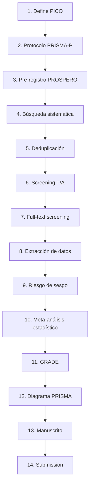

# Meta-analysis Optimization

> Plantilla y workflow para conducir meta-análisis médicos siguiendo PRISMA 2020, optimizada para reducir trabajo repetitivo y mantener trazabilidad completa.

## ⚡ TL;DR

Este es un **template repository**. No trabajes directo aquí. Para cada meta-análisis nuevo:

1. En GitHub, click en **"Use this template" → Create a new repository**
2. Nombra tu repo: `meta-<tema>-<intervencion>` (ej. `meta-diabetes-metformina`)
3. Clona localmente: `git clone <url> && cd <repo>`
4. Crea venv: `python3 -m venv .venv && .venv/bin/pip install -r requirements.txt`
5. Abre Claude Code y dile: "iniciemos meta-análisis sobre <tema>"

Cada meta-análisis vive en su propio repo — quedan independientes, versionados, y puedes compartirlos uno por uno con coautores.

## 🧠 Filosofía

- **PRISMA es la norma**, no una guía. Cada decisión queda registrada con justificación.
- **Trazabilidad sobre velocidad**: si no se puede reproducir, no sirve.
- **Protocolo vivo**: se redacta en paralelo a la búsqueda, no después.
- **Un paper = una nota .md** con frontmatter completo (DOI como ID primario).
- **Datos crudos en CSV**, narrativa después. Toda transformación va en script versionado.

## 📐 Estructura del proyecto

```
meta-<tema>/
├── README.md                          # este archivo (para tu proyecto, customizado)
├── CLAUDE.md                          # workflow + reglas para Claude Code
├── STATUS.md                          # ⭐ panel de control: dónde estás, qué sigue
├── .claude/skills/                    # 9 skills automatizados (ver abajo)
├── protocolo/
│   ├── protocolo.md                   # PICO + métodos (PRISMA-P 2015)
│   └── prospero-submission.md         # texto para formulario PROSPERO
├── busqueda/
│   ├── strategy.md                    # strings de búsqueda por DB
│   └── results-<db>.csv               # resultados por base
├── extraccion/
│   ├── screening.csv                  # decisiones T/A + full-text + razones
│   ├── papers/                        # 1 .md por paper incluido
│   │   └── doi-10-XXXX-YYYY.md
│   ├── extraction.csv                 # datos cuantitativos por outcome
│   └── rob.csv                        # riesgo de sesgo dominio por dominio
├── analisis/
│   ├── stats.py                       # script meta-análisis reproducible
│   ├── results-<outcome>.md           # resultados por outcome
│   ├── grade-summary.md               # tabla GRADE / Summary of Findings
│   ├── prisma-flow.md                 # diagrama PRISMA mermaid
│   ├── forest-<outcome>.png
│   └── funnel-<outcome>.png
├── manuscrito.md                      # draft del manuscrito (genera /manuscript-prisma)
├── requirements.txt                   # deps Python
└── .gitignore
```

## 🔄 Workflow detallado (paso a paso)



### Paso 1 — Define PICO

Edita `STATUS.md` y `protocolo/protocolo.md` con tu **P** (población), **I** (intervención), **C** (comparador), **O** (outcomes primario y secundarios).

### Paso 2 — Protocolo completo

Completa todas las secciones de `protocolo/protocolo.md` (PRISMA-P 2015 checklist). Si te falta algo, Claude te pregunta.

### Paso 3 — Pre-registro PROSPERO

```
> /prospero-register
```

Claude lee tu protocolo y genera `protocolo/prospero-submission.md` con el texto exacto para cada uno de los 32 campos del formulario PROSPERO. Tú copias y pegas en https://www.crd.york.ac.uk/prospero/. Toma ~30 min.

### Paso 4 — Búsqueda sistemática

```
> /prisma-search
```

Claude:
- Lee tu PICO
- Identifica MeSH terms y sinónimos
- Construye strings para PubMed, Cochrane, Embase
- Ejecuta búsqueda en PubMed vía MCP biomcp (con tu NCBI API key)
- Guarda resultados en `busqueda/results-*.csv`
- Reporta conteos para el diagrama PRISMA

### Paso 5 — Deduplicación

```
> /prisma-search dedup
```

Consolida todos los CSVs en `busqueda/results-merged-dedup.csv`, deduplica por DOI > PMID > título normalizado.

### Paso 6 — Screening T/A

```
> /screen-paper batch
```

Por cada paper:
- Lee título + abstract
- Aplica criterios de inclusión/exclusión
- Decisión: include / exclude / maybe (→ full-text)
- Razón documentada (categorías estandarizadas)
- Fila en `extraccion/screening.csv`

### Paso 7 — Full-text

Para los marcados "maybe" o "include", consigues el PDF (Zotero hace casi todo automático). Luego:

```
> /screen-paper fulltext doi:10.XXXX/YYYY
```

Decisión final + razón.

### Paso 8 — Extracción de datos

```
> /extract-data doi:10.XXXX/YYYY
```

Por cada paper incluido:
- Crea `extraccion/papers/doi-XXX.md` con frontmatter completo (autor, año, PICO, n, efecto, CI, p)
- Crea nota espejo en tu vault de Obsidian (`Metaanalisis/papers/`)
- Agrega fila a `extraccion/extraction.csv` para meta

### Paso 9 — Riesgo de sesgo

```
> /assess-rob doi:10.XXXX/YYYY
```

ROB-2 (para RCT) o Newcastle-Ottawa (observacional). 5 dominios con justificación cada uno.

### Paso 10 — Meta-análisis estadístico

```
> /run-metaanalysis outcome:<nombre>
```

Cuando tienes ≥3 estudios para un outcome. Claude:
- Calcula pooled effect (random effects, DerSimonian-Laird)
- Heterogeneidad (I², τ², Q)
- Genera forest plot
- Genera funnel plot + Egger (si k≥10)
- Sensibilidad leave-one-out
- Guarda todo en `analisis/`

### Paso 11 — GRADE

```
> /grade-evidence
```

Por cada outcome, aplica los 5 dominios de GRADE y genera tabla Summary of Findings.

### Paso 12 — Diagrama PRISMA

```
> /prisma-flow
```

Cuenta automáticamente desde los CSVs y genera diagrama mermaid + tabla de conteos por razón de exclusión. Valida coherencia (si los números no cuadran, alerta).

### Paso 13 — Manuscrito

```
> /manuscript-prisma
```

Genera `manuscrito.md` siguiendo PRISMA 2020 (27 items): Abstract estructurado, Introduction, Methods, Results, Discussion, Conclusions, + checklist PRISMA marcado. Pulla automáticamente del protocolo, CSVs y resultados.

### Paso 14 — Submission

Manual: revisas, pulvas Discussion (lo más subjetivo), formateas referencias según la revista target, sometes.

## 💾 ¿Cómo retomar dónde me quedé?

Todo el estado vive en archivos del repo:

- `STATUS.md` — panel de control con check-list de avance
- `extraccion/screening.csv` — qué papers ya screened, cuáles quedan
- `extraccion/papers/` — qué papers ya extraídos
- `analisis/prisma-flow.md` — conteos actualizados
- Commits de git — historial completo de qué hiciste cuándo

Cuando vuelvas:

```bash
cd ~/projects/meta-<tema>
git pull
# Abre Claude Code y di: "qué sigue en este meta-análisis?"
# Claude lee STATUS.md + CSVs y te dice exactamente dónde retomas
```

## 🧰 MCPs requeridos (configuración usuario)

Estos MCPs deben estar configurados en Claude Code (los configura una sola vez globalmente, sirven para todos tus meta-análisis):

| MCP | Para qué |
|---|---|
| **biomcp** | PubMed + ClinicalTrials.gov + variantes (con NCBI API key) |
| **openalex** | 240M papers + redes de citas |
| **zotero** | Lectura/escritura biblioteca local |
| **github** | Versionado |
| **Scholar Gateway** (Anthropic) | Snowballing semántico |
| **Consensus** (Anthropic) | Evidence synthesis preliminar |
| **Context7** (Anthropic) | Docs Python (scipy, statsmodels) |

Acceso a Obsidian es directo vía filesystem (no requiere MCP).

## 📚 Referencias

- PRISMA 2020 statement: [Page et al, BMJ 2021;372:n71](https://www.bmj.com/content/372/bmj.n71)
- PRISMA-P 2015 (protocolos): [Moher et al, Syst Rev 2015;4:1](https://systematicreviewsjournal.biomedcentral.com/articles/10.1186/2046-4053-4-1)
- GRADE handbook: https://gdt.gradepro.org/app/handbook/handbook.html
- ROB-2 tool: https://www.riskofbias.info/welcome/rob-2-0-tool
- PROSPERO: https://www.crd.york.ac.uk/prospero/

## 📄 Licencia

MIT — usa, modifica, comparte. Si esta plantilla te ayudó, considera abrir un PR con mejoras.
