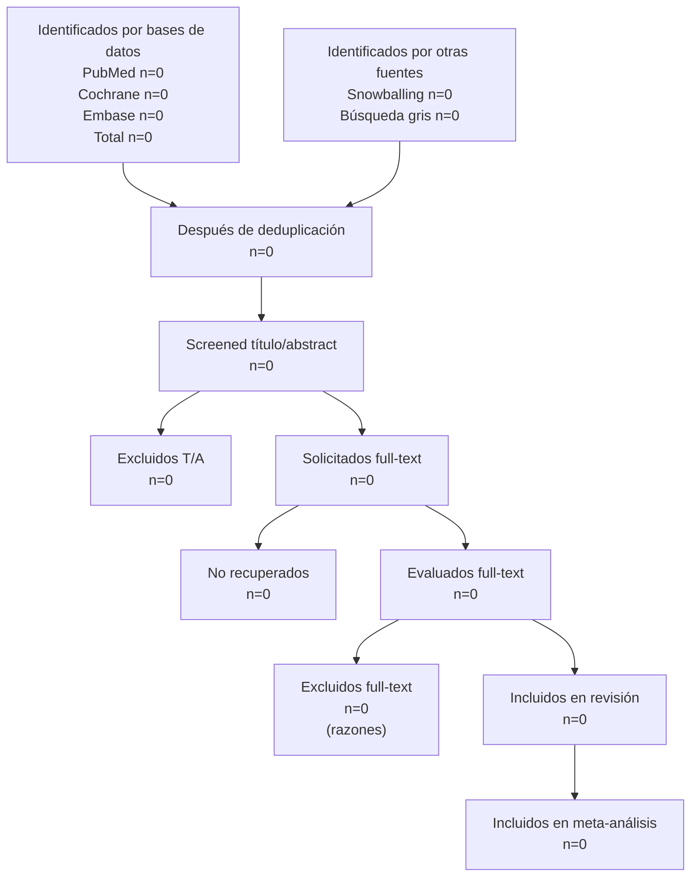

# Diagrama de flujo PRISMA 2020

> Regenerar con `/prisma-flow` cada vez que cambien los CSV.

## Conteos por etapa

| Etapa | n | Notas |
|---|---|---|
| Identificados (PubMed) | 0 | |
| Identificados (Cochrane) | 0 | |
| Identificados (Embase) | 0 | |
| Identificados (otras) | 0 | |
| **Total identificados** | **0** | |
| Duplicados removidos | 0 | |
| A screening | 0 | |
| Excluidos T/A | 0 | desglose abajo |
| A full-text | 0 | |
| Excluidos full-text | 0 | desglose abajo |
| **Incluidos en revisión** | **0** | |
| **Incluidos en meta** | **0** | por outcome |

## Razones de exclusión

| Razón | T/A | Full-text |
|---|---|---|
| wrong_population | 0 | 0 |
| wrong_intervention | 0 | 0 |
| wrong_comparator | 0 | 0 |
| wrong_outcome | 0 | 0 |
| wrong_design | 0 | 0 |
| wrong_language | 0 | 0 |
| conference_abstract | 0 | 0 |
| no_full_text | 0 | 0 |
| duplicate | 0 | 0 |
| editorial_or_commentary | 0 | 0 |
